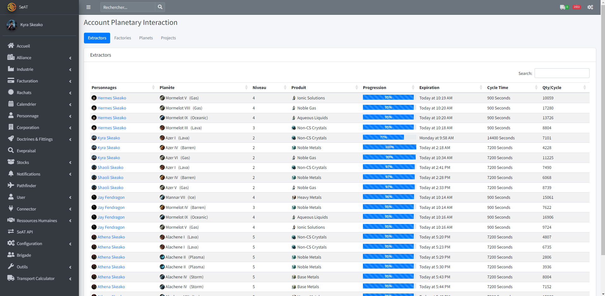
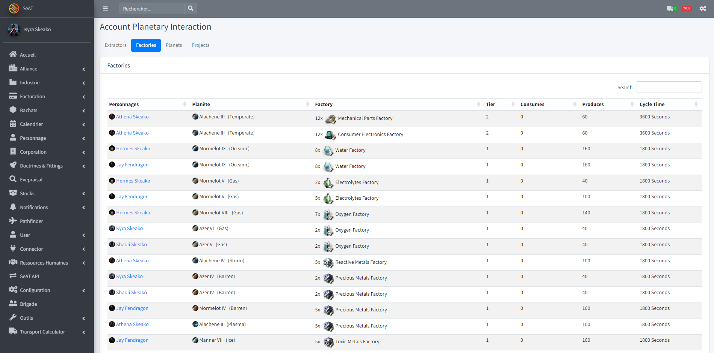
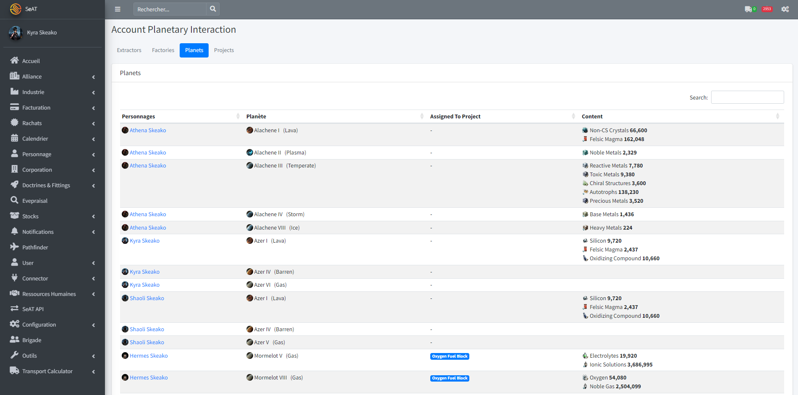
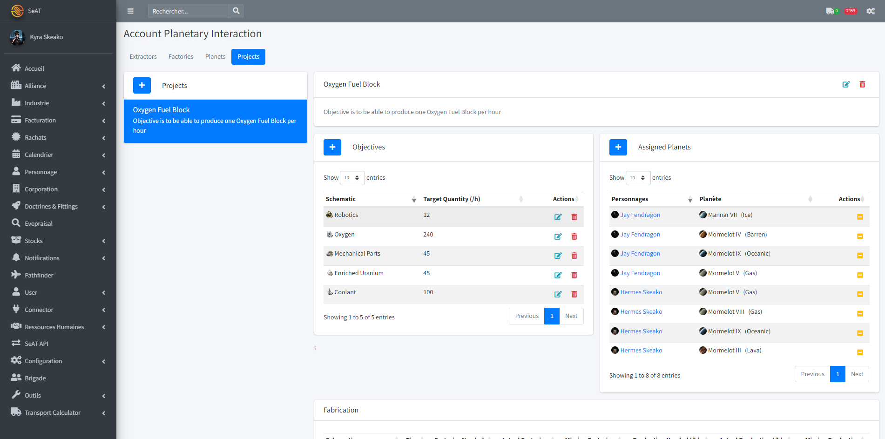
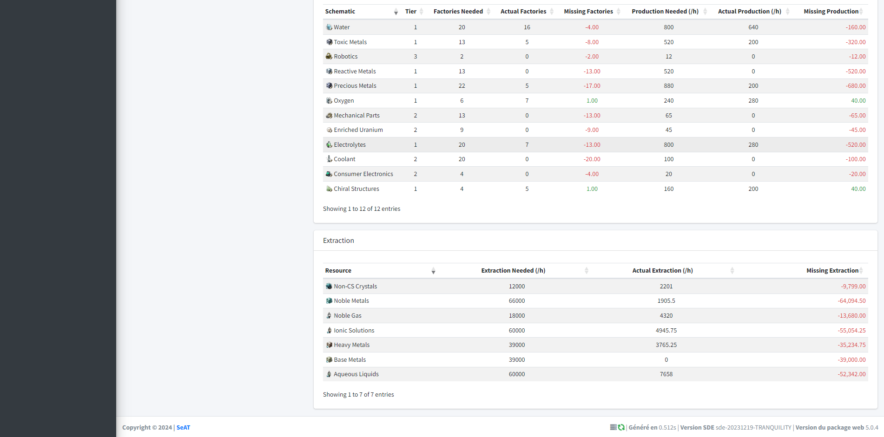

# SeAT Planetary Industry plugin

Planetary Industry plugin for EVE SeAT

# Features

* View all your characters planets, extractors and factories regrouped in one page (Menu Characters > Account PI)
* Create Planetary Industry Project, define production goals, assign planets and see what production is needed !
* Create Planetary Industry Projects for your corporation and help your corp mate identify what they need to produce

# Release

https://packagist.org/packages/hermesdj/seat-planetary-industry

# Compatibility

| SeAT Core | Planetary Industry | Branch                                                                    |
|-----------|--------------------|---------------------------------------------------------------------------|
| 5.x       | 1.x                | [master](https://github.com/hermesdj/seat-planetary-industry/tree/master) |

# Installation

Add hermesdj/seat-planetary-industry to your installed plugin list.

* `php artisan eve:update:sde:planetary` in the SeAT root directory

This is required to sync the planetary industry factory schematics once with the SDE. It should run once a month after
that automatically.

# Feedbacks or support

@jaysgaming2023 on eve-seat discord  
jays.gaming.contact@gmail.com
Jay Fendragon/Kyra Skeako in game

# Screenshots

## Account Planetary Industry

### Extractors View

### Factories View

### Planets View

Assigned to allows you to see to which project a planet is assigned. A planet can only be assigned to one project (corp
or personal)

### Projects View

